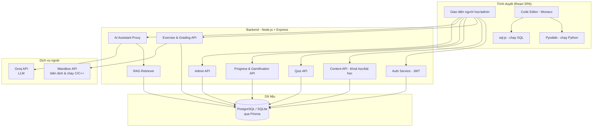
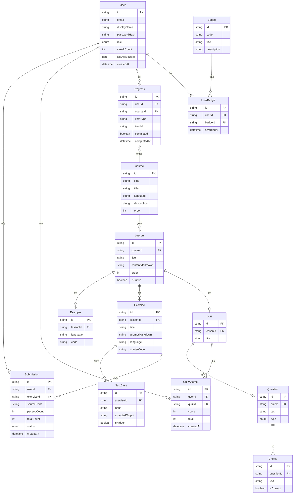
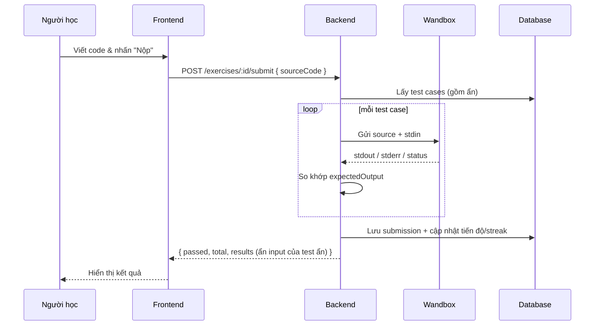
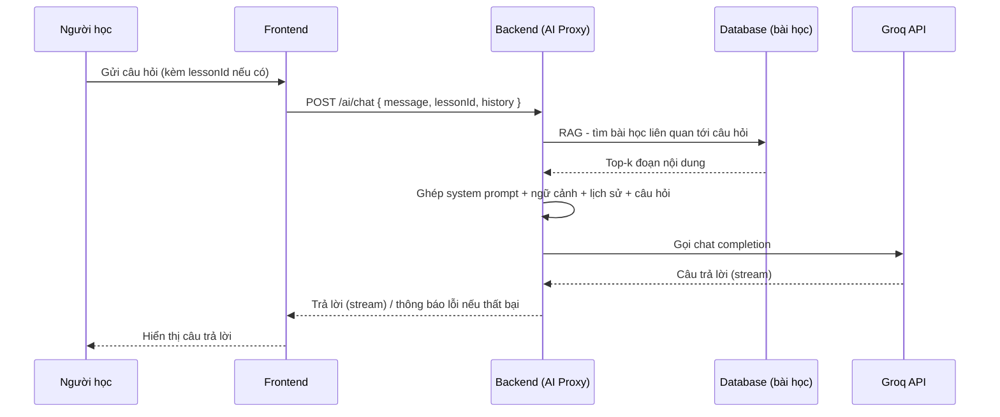

# Design Document

## Overview

Tài liệu này mô tả thiết kế kỹ thuật cho **Website hỗ trợ học lập trình** (`learn-programming-platform`) — nền tảng học SQL, C, C++, Python với trình chạy code trực tiếp, bài tập chấm tự động, quiz, theo dõi tiến độ, gamification, trợ lý AI giới hạn phạm vi (Groq + RAG) và trang quản trị đầy đủ.

Thiết kế hướng tới một lập trình viên duy nhất triển khai, ưu tiên công nghệ phổ biến, dễ học, dễ bảo vệ trước hội đồng, và **không phụ thuộc Docker** (máy phát triển hiện chưa có Docker).

### Mục tiêu thiết kế

- Tách bạch rõ frontend / backend / dịch vụ ngoài để dễ trình bày kiến trúc.
- An toàn khi thực thi code người dùng: tách "sân chơi thử" (playground) khỏi "chấm bài" (grading).
- Trợ lý AI bị giới hạn phạm vi bằng system prompt + RAG, không để lộ khoá API.
- Có thể triển khai theo giai đoạn (MVP trước) nhưng vẫn giữ kiến trúc hoàn chỉnh.

### Quyết định công nghệ chính (và lý do)

| Hạng mục | Lựa chọn | Lý do |
|----------|----------|-------|
| Frontend | React + Vite + TypeScript | Phổ biến, nhanh, type-safe, dễ tìm tài liệu. |
| UI styling | TailwindCSS | Dựng giao diện nhanh, responsive sẵn. |
| Code editor | Monaco Editor / CodeMirror 6 | Trình soạn thảo code chuyên nghiệp (Monaco là lõi của VS Code). |
| Backend | Node.js + Express + TypeScript | Cùng ngôn ngữ với frontend, một dev dễ quản lý. Máy đã có Node 24. |
| ORM | Prisma | Type-safe, migration rõ ràng, dễ trình bày schema. |
| Database | PostgreSQL | CSDL quan hệ mạnh, hỗ trợ full-text search sẵn (tsvector) phục vụ RAG, chuẩn để bảo vệ đồ án. |
| Xác thực | JWT (access token) lưu HttpOnly cookie | An toàn, không cần session store. |
| Chạy Python (thử) | Pyodide (WASM, client-side) | Chạy ngay trên trình duyệt, không cần server, an toàn tuyệt đối. |
| Chạy SQL (thử) | sql.js (SQLite WASM, client-side) | Tương tự, chạy trong trình duyệt. |
| Chạy/chấm C, C++ và chấm bài | Wandbox API | Biên dịch & chạy online, miễn phí, KHÔNG cần API key/thẻ tín dụng. Phù hợp đồ án sinh viên. |
| Trợ lý AI | Groq API (gọi từ backend) | LLM nhanh, free tier rộng. Khoá API giữ ở server. |
| RAG | Full-text search trên nội dung bài học | Đơn giản, đủ tốt cho phạm vi 4 ngôn ngữ, không cần hạ tầng vector. |

> Ghi chú: Phần "chạy thử" (Try it Yourself) ưu tiên client-side cho Python/SQL để miễn phí và an toàn. Phần "chấm bài tập" luôn chạy qua server/Wandbox để giữ kín test case ẩn và đảm bảo kết quả khách quan.
>
> Ghi chú lựa chọn dịch vụ: ban đầu thiết kế dự kiến dùng Judge0 (qua RapidAPI), nhưng gói free của RapidAPI yêu cầu thẻ tín dụng để đăng ký. Đã chuyển sang **Wandbox** — dịch vụ biên dịch online mã nguồn mở, miễn phí, không cần key/thẻ — để phù hợp điều kiện sinh viên. Kiến trúc không đổi: backend vẫn là lớp trung gian gọi dịch vụ chạy code bên ngoài, nên có thể đổi lại sang Judge0 hoặc self-host về sau mà không ảnh hưởng phần còn lại.

## Architecture

### Sơ đồ kiến trúc tổng thể

### Phân tầng backend

- **Tầng Route/Controller**: định nghĩa endpoint, xác thực đầu vào (validation), gọi service.
- **Tầng Service**: chứa logic nghiệp vụ (chấm bài, tính tiến độ, RAG, ghép prompt AI).
- **Tầng Repository (Prisma)**: truy cập dữ liệu.
- **Middleware**: xác thực JWT, phân quyền (learner/admin), rate limit, xử lý lỗi tập trung.

### Luồng triển khai

- Frontend build tĩnh (Vite) — có thể deploy lên Vercel/Netlify hoặc phục vụ trực tiếp từ Express khi nộp bài.
- Backend chạy Node — deploy lên Render/Railway hoặc chạy local khi demo.
- Database: PostgreSQL (chạy local khi phát triển; dùng dịch vụ managed như Supabase/Render/Neon khi deploy).

## Components and Interfaces

### Frontend

| Thành phần | Trách nhiệm |
|-----------|-------------|
| `AppRouter` | Định tuyến trang, bảo vệ route cần đăng nhập/admin. |
| `AuthContext` | Lưu trạng thái đăng nhập, cung cấp hàm login/logout. |
| `CourseList` / `CourseDetail` | Hiển thị danh sách khoá và mục lục bài học. |
| `LessonView` | Hiển thị nội dung bài học, ví dụ code, điều hướng trước/sau. |
| `CodePlayground` | Editor + nút Chạy; điều phối Pyodide/sql.js (client) hoặc gọi API (C/C++). |
| `ExerciseView` | Đề bài, editor, nút Nộp; hiển thị kết quả chấm. |
| `QuizView` | Hiển thị câu hỏi trắc nghiệm, chấm điểm. |
| `AIChatWidget` | Khung chat với trợ lý AI; gửi kèm ngữ cảnh bài học hiện tại. |
| `Dashboard` | Tiến độ, % hoàn thành, huy hiệu, streak. |
| `RoadmapView` | Lộ trình học theo khoá kèm trạng thái. |
| `AdminLayout` + các trang CRUD | Quản lý khoá/bài học/bài tập/quiz/người dùng. |

### Backend services & endpoints chính

Tiền tố API: `/api`. Mọi phản hồi dạng JSON. Lỗi theo cấu trúc chung (mục Error Handling).

#### Auth (`/api/auth`)
- `POST /register` — đăng ký { email, displayName, password }.
- `POST /login` — đăng nhập { email, password } → set HttpOnly cookie + trả thông tin user.
- `POST /logout` — xoá cookie phiên.
- `GET /me` — lấy thông tin người dùng hiện tại.

#### Content (`/api/courses`, `/api/lessons`)
- `GET /courses` — danh sách 4 khoá.
- `GET /courses/:slug` — chi tiết khoá + mục lục bài học.
- `GET /lessons/:id` — nội dung bài học + bài học trước/sau.
- `GET /search?q=` — tìm kiếm bài học theo từ khoá.

#### Code execution (`/api/run`)
- `POST /run` — chạy code không chấm điểm cho C/C++ qua Wandbox: { language, sourceCode, stdin } → { stdout, stderr, compileOutput, status, timeMs }.
  - (Python/SQL "chạy thử" xử lý ở client, không qua endpoint này.)

#### Exercise & grading (`/api/exercises`)
- `GET /exercises/:id` — đề bài + code khởi tạo + test case công khai.
- `POST /exercises/:id/submit` — { sourceCode, language } → chạy toàn bộ test case (qua Wandbox), trả { passed, total, results[], status }. Lưu submission nếu đã đăng nhập.

#### Quiz (`/api/quizzes`)
- `GET /lessons/:id/quiz` — câu hỏi quiz của bài học.
- `POST /quizzes/:id/submit` — { answers[] } → { score, total, corrections[] }.

#### Progress & gamification (`/api/progress`)
- `GET /progress` — tổng quan tiến độ theo khoá, huy hiệu, streak.
- `POST /progress/complete` — đánh dấu hoàn thành { type: lesson|exercise|quiz, refId }.

#### AI assistant (`/api/ai`)
- `POST /ai/chat` — { message, lessonId?, history[] } → trả câu trả lời. Backend thực hiện RAG + ghép system prompt + gọi Groq. Hỗ trợ streaming nếu khả thi.

#### Admin (`/api/admin`)
- `GET/POST/PUT/DELETE /admin/courses|lessons|exercises|quizzes` — CRUD nội dung.
- `GET /admin/users` — danh sách người dùng.
- Tất cả endpoint admin yêu cầu vai trò `ADMIN`.

## Data Models

### Sơ đồ quan hệ (ERD)

### Ghi chú mô hình dữ liệu

- `User.role` ∈ { `LEARNER`, `ADMIN` }.
- `Submission.status` ∈ { `PASSED`, `FAILED`, `ERROR` }.
- `Question.type` ∈ { `SINGLE`, `MULTI` } (một hoặc nhiều đáp án đúng).
- `TestCase.isHidden = true` ⇒ không trả input/expectedOutput về client.
- Tiến độ lưu theo từng item (lesson/exercise/quiz) để tính % theo khoá.

## Code Execution Design

### Phân loại theo mục đích

1. **Playground (chạy thử, không chấm):**
   - Python → **Pyodide** chạy trong Web Worker phía client.
   - SQL → **sql.js** (SQLite WASM) phía client.
   - C/C++ → gọi `POST /api/run` (backend) → Wandbox.
2. **Grading (chấm bài tập):** mọi ngôn ngữ đều chạy qua **backend → Wandbox** với toàn bộ test case (kể cả ẩn). Lý do: giữ kín test case ẩn, kết quả khách quan, chống gian lận.

### Luồng chấm bài (sequence)

### An toàn & giới hạn

- Giới hạn thời gian chạy mỗi lần (timeout phía backend ~20s) — Wandbox tự giới hạn tài nguyên phía dịch vụ.
- Rate limit endpoint `/run` và `/submit` theo người dùng/IP.
- So khớp output: chuẩn hoá khoảng trắng cuối dòng và cuối file để tránh sai lệch vặt.

## AI Assistant Design (Groq + RAG)

### Nguyên tắc

- **Không train model.** Dùng model có sẵn của Groq (ví dụ dòng Llama) qua API.
- Giới hạn phạm vi bằng **system prompt** nghiêm ngặt + **RAG** đưa nội dung bài học liên quan vào ngữ cảnh.
- Khoá API Groq chỉ nằm ở backend (biến môi trường), không bao giờ gửi ra client.

### Luồng xử lý câu hỏi

### Chiến lược RAG (đơn giản, đủ dùng)

- Vì nội dung chỉ gồm 4 ngôn ngữ và số bài học hữu hạn, dùng **full-text search** trên `Lesson.contentMarkdown` + `title` để lấy top-k bài liên quan tới câu hỏi.
- Dùng PostgreSQL full-text search: `tsvector`/`tsquery` với cấu hình ngôn ngữ phù hợp, đánh chỉ mục GIN trên cột tsvector để truy vấn nhanh.
- Ghép top-k đoạn vào ngữ cảnh kèm nguồn (tên bài học) để trả lời có dẫn chiếu.
- (Nâng cao tuỳ chọn về sau: thay full-text bằng vector embeddings + pgvector.)

### Giới hạn phạm vi (guardrail)

System prompt quy định rõ: trợ lý chỉ trả lời các câu hỏi về SQL/C/C++/Python và nội dung khoá học; nếu ngoài phạm vi thì từ chối lịch sự và mời quay lại chủ đề. Bổ sung kiểm tra phía backend: nếu RAG không tìm được nội dung liên quan và câu hỏi không chứa từ khoá lập trình, trả về câu từ chối mặc định (giảm chi phí gọi API).

## Error Handling

- **Cấu trúc lỗi chung:** `{ "error": { "code": string, "message": string, "details"?: any } }`.
- **Mã HTTP:** 400 (đầu vào sai), 401 (chưa đăng nhập), 403 (không đủ quyền), 404 (không tìm thấy), 429 (vượt rate limit), 500 (lỗi máy chủ), 502/504 (dịch vụ ngoài Wandbox/Groq lỗi hoặc timeout).
- **Dịch vụ ngoài:** bọc lời gọi Wandbox/Groq trong timeout + thử lại hữu hạn; khi thất bại trả thông báo thân thiện và cho người dùng thử lại.
- **Frontend:** hiển thị thông báo lỗi dễ hiểu, không lộ chi tiết kỹ thuật nhạy cảm; giữ lại code người dùng đã viết khi có lỗi.
- **Xử lý tập trung:** middleware error handler ở backend chuẩn hoá mọi lỗi về cấu trúc chung và ghi log.

## Security Considerations

- Mật khẩu băm bằng bcrypt/argon2 (có salt). Không log mật khẩu.
- JWT trong cookie HttpOnly + SameSite; CSRF protection cho thao tác thay đổi trạng thái.
- Validate & sanitize toàn bộ đầu vào (chống XSS, SQL Injection). Prisma giúp tránh SQL Injection ở tầng truy vấn; nội dung Markdown hiển thị phải được sanitize.
- Khoá bí mật (Groq API key, DB URL, JWT secret) đặt trong biến môi trường, có file `.env.example` mẫu, không commit `.env`. (Wandbox không cần khoá.)
- Phân quyền chặt khu vực admin bằng middleware kiểm tra role.
- Rate limit cho `/run`, `/submit`, `/ai/chat` để tránh lạm dụng tài nguyên/chi phí.

## Correctness Properties

Các thuộc tính đúng đắn dưới đây là những bất biến (invariant) hệ thống phải luôn thoả mãn. Chúng vừa định hướng kiểm thử, vừa là điểm để trình bày tính chặt chẽ khi bảo vệ.

### Property 1: Bảo mật mật khẩu
Không tồn tại đường đi nào lưu hoặc ghi log mật khẩu ở dạng văn bản thường; trường lưu trong CSDL luôn là chuỗi băm.

**Validates: Requirements 1.1, 10.1**

### Property 2: Kín test case ẩn
Mọi phản hồi trả về client KHÔNG chứa `input`/`expectedOutput` của test case có `isHidden = true`.

**Validates: Requirements 4.5**

### Property 3: Tính nhất quán của chấm bài
Một bài tập được đánh dấu `PASSED` khi và chỉ khi `passedCount == totalCount` với `totalCount` bằng tổng số test case (cả ẩn lẫn công khai).

**Validates: Requirements 4.2, 4.3, 4.4**

### Property 4: Phân quyền admin
Mọi endpoint dưới `/api/admin` chỉ thực thi khi người gọi có `role == ADMIN`; ngược lại trả 403 và không gây thay đổi dữ liệu.

**Validates: Requirements 9.1**

### Property 5: Tính đúng của tiến độ
Phần trăm hoàn thành của một khoá luôn nằm trong [0, 100] và bằng (số item hoàn thành / tổng số item của khoá) × 100.

**Validates: Requirements 7.3, 7.4**

### Property 6: Tính đơn điệu của hoàn thành
Khi một item đã `completed = true`, các thao tác hợp lệ tiếp theo không làm nó trở lại `false` (trừ thao tác reset chủ đích của admin/người dùng).

**Validates: Requirements 7.1**

### Property 7: Quy tắc streak
Streak tăng tối đa 1 cho mỗi ngày có hoạt động; nếu khoảng cách giữa `lastActiveDate` và ngày hoạt động mới lớn hơn 1 ngày thì streak được đặt lại về 1.

**Validates: Requirements 8.2, 8.3**

### Property 8: Giới hạn phạm vi AI
Với câu hỏi ngoài phạm vi (không liên quan SQL/C/C++/Python hoặc nội dung khoá học), trợ lý luôn trả về câu từ chối thay vì nội dung ngoài chủ đề.

**Validates: Requirements 5.3**

### Property 9: Không lộ bí mật
Khoá API Groq và JWT secret không bao giờ xuất hiện trong phản hồi gửi về client hay trong mã nguồn frontend.

**Validates: Requirements 5.8, 10.3**

### Property 10: Bảo toàn dữ liệu người dùng khi lỗi
Khi thực thi/chấm bài thất bại do dịch vụ ngoài, code người dùng vừa nhập không bị mất ở phía giao diện.

**Validates: Requirements 3.5, 5.6**

## Testing Strategy

- **Unit test (backend):** logic chấm bài (so khớp output, test ẩn), tính tiến độ/streak, guardrail AI, hàm RAG chọn top-k. Dùng Vitest/Jest.
- **Integration test:** các endpoint chính (auth, submit, ai/chat) với CSDL test (PostgreSQL test riêng hoặc schema tạm). Mock Wandbox và Groq để không gọi mạng thật.
- **Frontend:** test component then chốt (CodePlayground, ExerciseView, QuizView) bằng React Testing Library; mock API.
- **E2E (tuỳ chọn nếu còn thời gian):** luồng đăng nhập → học bài → nộp bài → xem tiến độ, bằng Playwright.
- **Thủ công:** kiểm tra responsive trên màn hình nhỏ và các tiêu chí accessibility cơ bản.

## Triển khai theo giai đoạn (để luôn có bản chạy được)

1. **MVP học liệu:** Auth + Course/Lesson + đọc bài + playground Python/SQL client-side.
2. **Thực hành & chấm:** Exercise + Wandbox + chấm tự động + Quiz.
3. **Cá nhân hoá:** Progress + Dashboard + Roadmap + Gamification.
4. **Trợ lý AI:** AI proxy + RAG + guardrail + streaming.
5. **Quản trị:** Admin CRUD đầy đủ + quản lý người dùng.
6. **Hoàn thiện:** bảo mật, rate limit, responsive, accessibility, test, tài liệu báo cáo.

Mỗi giai đoạn kết thúc đều cho ra một bản chạy được, giảm rủi ro khi cận deadline.
