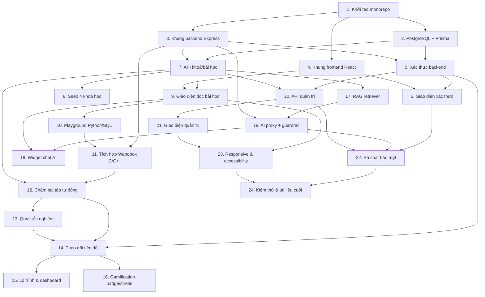

# Implementation Plan

## Overview

Kế hoạch triển khai chia theo 6 giai đoạn (xem mục "Triển khai theo giai đoạn" trong design). Mỗi giai đoạn kết thúc cho ra một bản chạy được. Thực hiện tuần tự từ trên xuống; mỗi task con đều gắn với yêu cầu tương ứng để đảm bảo phủ hết đặc tả.

## Tasks

## Giai đoạn 0: Khởi tạo dự án & hạ tầng

- [x] 1. Khởi tạo cấu trúc dự án monorepo
  - Tạo thư mục gốc với hai gói: `client` (React + Vite + TS) và `server` (Express + TS).
  - Cấu hình TypeScript, ESLint, Prettier cho cả hai gói.
  - Tạo `.gitignore`, `.env.example` (DB URL, JWT secret, GROQ_API_KEY, WANDBOX_URL) và README mô tả cách chạy.
  - _Requirements: 10.3_

- [x] 2. Thiết lập PostgreSQL + Prisma
  - Cài Prisma, khởi tạo `schema.prisma` trỏ tới PostgreSQL qua biến môi trường.
  - Định nghĩa toàn bộ model theo ERD: User, Course, Lesson, Example, Exercise, TestCase, Submission, Quiz, Question, Choice, QuizAttempt, Progress, Badge, UserBadge cùng các enum (role, status, question type).
  - Chạy migration đầu tiên và sinh Prisma Client.
  - _Requirements: 1.1, 2.1, 4.1, 6.1, 7.1, 8.1, 9.2_

- [x] 3. Khung backend Express + middleware nền
  - Dựng app Express với cấu trúc tầng (routes/controllers/services/repositories).
  - Thêm middleware: CORS, JSON parser, cookie parser, error handler tập trung (cấu trúc lỗi chung), logger.
  - Thêm middleware rate limit dùng được cho các route nhạy cảm.
  - Viết health-check endpoint và xác minh server chạy.
  - _Requirements: 10.6_

- [x] 4. Khung frontend React + routing + layout
  - Dựng app Vite + React + TS + Tailwind, cấu hình client gọi API (axios/fetch wrapper).
  - Thêm `AppRouter` với route công khai và route được bảo vệ (placeholder).
  - Tạo layout chung (header, nav, footer) responsive.
  - _Requirements: 2.1, 10.4_

## Giai đoạn 1: Xác thực & nội dung học liệu (MVP)

- [x] 5. Triển khai xác thực phía backend
- [x] 5.1 Đăng ký & băm mật khẩu
  - Endpoint `POST /api/auth/register` với validation (email hợp lệ, mật khẩu ≥ 8 ký tự), chống trùng email, băm mật khẩu bằng bcrypt/argon2.
  - _Requirements: 1.1, 1.2, 1.7, 10.1_
- [x] 5.2 Đăng nhập, đăng xuất, phiên JWT
  - `POST /api/auth/login` cấp JWT trong cookie HttpOnly; `POST /api/auth/logout` xoá cookie; `GET /api/auth/me`.
  - Thông báo lỗi đăng nhập không tiết lộ trường nào sai.
  - _Requirements: 1.3, 1.4, 1.5_
- [x] 5.3 Middleware xác thực & phân quyền
  - Middleware `requireAuth` và `requireRole(ADMIN)`; chuyển hướng/từ chối phù hợp.
  - Viết unit test cho luồng đăng ký/đăng nhập và phân quyền.
  - _Requirements: 1.6, 9.1_

- [x] 6. Giao diện xác thực phía frontend
  - Trang đăng ký/đăng nhập, `AuthContext`, bảo vệ route cần đăng nhập, hiển thị trạng thái người dùng và nút đăng xuất.
  - _Requirements: 1.3, 1.5, 1.6_

- [x] 7. API nội dung khoá học & bài học
  - `GET /api/courses`, `GET /api/courses/:slug`, `GET /api/lessons/:id` (kèm bài trước/sau).
  - `GET /api/search?q=` tìm kiếm bài học theo từ khoá.
  - _Requirements: 2.1, 2.2, 2.3, 2.4, 2.6_

- [x] 8. Dữ liệu mẫu (seed) cho 4 khoá học
  - Script seed tạo 4 khoá (SQL, C, C++, Python), mỗi khoá vài bài học mẫu có nội dung Markdown + ví dụ code, một admin mặc định.
  - _Requirements: 2.1, 2.2, 9.2_

- [x] 9. Giao diện đọc bài học
  - `CourseList`, `CourseDetail` (mục lục), `LessonView` render Markdown an toàn (sanitize) + syntax highlighting, điều hướng trước/sau, thanh tìm kiếm.
  - Cho phép khách đọc nội dung công khai.
  - _Requirements: 2.1, 2.2, 2.3, 2.4, 2.5, 2.6, 10.2_

- [x] 10. Trình chạy code client-side cho Python & SQL
  - `CodePlayground` với Monaco Editor; tích hợp Pyodide (Web Worker) chạy Python và sql.js chạy SQL; nút Chạy, vùng kết quả, xử lý lỗi và giới hạn thời gian phía client.
  - Gắn playground vào ví dụ code trong `LessonView`.
  - _Requirements: 3.1, 3.2, 3.4, 3.5, 3.6_

## Giai đoạn 2: Thực hành & chấm điểm

- [x] 11. Tích hợp Wandbox cho C/C++
- [x] 11.1 Service gọi Wandbox
  - Viết service gọi Wandbox (compile.json) với timeout, ánh xạ ngôn ngữ C/C++ sang compiler, chuẩn hoá kết quả (stdout/stderr/compileOutput/status/time).
  - _Requirements: 3.3, 3.7_
- [x] 11.2 Endpoint chạy thử C/C++
  - `POST /api/run` chạy code không chấm cho C/C++; áp rate limit; trả kết quả hoặc lỗi biên dịch.
  - Mở rộng `CodePlayground` để gọi `/api/run` khi ngôn ngữ là C/C++.
  - _Requirements: 3.3, 3.4, 3.5, 10.6_

- [x] 12. Chấm bài tập tự động
- [x] 12.1 API đề bài
  - `GET /api/exercises/:id` trả đề bài, code khởi tạo, chỉ test case công khai (ẩn input/output của test ẩn).
  - _Requirements: 4.1, 4.5_
- [x] 12.2 Service chấm bài
  - Chạy toàn bộ test case qua Wandbox, so khớp output có chuẩn hoá khoảng trắng, tính passed/total, xác định status (PASSED/FAILED/ERROR).
  - Đảm bảo phản hồi không lộ dữ liệu test ẩn.
  - Viết unit test cho logic chấm (Property 2, 3).
  - _Requirements: 4.2, 4.3, 4.4, 4.5_
- [x] 12.3 Lưu submission & endpoint nộp bài
  - `POST /api/exercises/:id/submit`: lưu submission khi đã đăng nhập, cập nhật tiến độ; cho khách thử nhưng không lưu; áp rate limit.
  - _Requirements: 4.6, 4.7, 10.6_
- [x] 12.4 Giao diện làm bài tập
  - `ExerciseView`: đề bài, editor, nút Nộp, hiển thị số test đã qua/tổng, thông báo Đạt/Chưa đạt; giữ lại code khi lỗi (Property 10).
  - _Requirements: 4.1, 4.3, 4.4_

- [x] 13. Quiz trắc nghiệm
- [x] 13.1 API quiz
  - `GET /api/lessons/:id/quiz` (không trả đáp án đúng), `POST /api/quizzes/:id/submit` chấm điểm, trả số đúng/tổng và đáp án đúng cho câu sai; lưu QuizAttempt nếu đã đăng nhập.
  - _Requirements: 6.1, 6.2, 6.3, 6.4_
- [x] 13.2 Giao diện quiz
  - `QuizView`: hiển thị câu hỏi, nộp, hiển thị kết quả và sửa lỗi.
  - _Requirements: 6.1, 6.2, 6.3_

## Giai đoạn 3: Tiến độ, lộ trình & gamification

- [x] 14. Theo dõi tiến độ
  - Service ghi nhận hoàn thành lesson/exercise/quiz (đảm bảo tính đơn điệu — Property 6); `GET /api/progress` tổng hợp % theo khoá (Property 5); `POST /api/progress/complete`.
  - Viết unit test cho tính % và tính đơn điệu.
  - _Requirements: 7.1, 7.2, 7.3, 7.4_

- [x] 15. Lộ trình & dashboard (frontend)
  - `RoadmapView` hiển thị các bước học kèm trạng thái; `Dashboard` hiển thị % hoàn thành từng khoá.
  - _Requirements: 7.2, 7.3, 7.4_

- [x] 16. Gamification: huy hiệu & streak
- [x] 16.1 Logic streak & badge (backend)
  - Cập nhật streak theo quy tắc (Property 7) khi có hoạt động; trao badge khi đạt mốc; seed danh sách badge.
  - Viết unit test cho quy tắc streak.
  - _Requirements: 8.1, 8.2, 8.3_
- [x] 16.2 Hiển thị huy hiệu & streak (frontend)
  - Hiển thị badge đã đạt và streak hiện tại trên `Dashboard`.
  - _Requirements: 8.4_

## Giai đoạn 4: Trợ lý AI (Groq + RAG)

- [x] 17. RAG retriever (PostgreSQL full-text search)
  - Thêm cột/chỉ mục tsvector cho nội dung bài học; service truy xuất top-k bài liên quan theo câu hỏi.
  - Viết unit test cho việc chọn top-k.
  - _Requirements: 5.2_

- [x] 18. AI proxy gọi Groq với guardrail
  - `POST /api/ai/chat`: ghép system prompt giới hạn phạm vi + ngữ cảnh RAG + lịch sử + câu hỏi; gọi Groq (giữ khoá ở server); hỗ trợ streaming; xử lý timeout/lỗi và cho thử lại.
  - Guardrail từ chối câu hỏi ngoài phạm vi (Property 8); không lộ khoá API (Property 9).
  - Áp rate limit. Viết unit test cho guardrail.
  - _Requirements: 5.1, 5.2, 5.3, 5.5, 5.6, 5.8, 10.3, 10.6_

- [x] 19. Widget chat AI (frontend)
  - `AIChatWidget`: khung chat, gửi kèm `lessonId` khi đang xem bài, trạng thái "đang trả lời", hiển thị lỗi và nút thử lại; nút "giải thích lỗi" gửi thông báo lỗi code cho AI.
  - _Requirements: 5.1, 5.4, 5.5, 5.7_

## Giai đoạn 5: Trang quản trị (Admin)

- [x] 20. API quản trị nội dung
  - CRUD `/api/admin/courses|lessons|exercises|quizzes` (gồm định nghĩa test case ẩn, câu hỏi/đáp án quiz); `GET /api/admin/users`. Mọi route yêu cầu role ADMIN (Property 4).
  - Viết integration test cho phân quyền admin.
  - _Requirements: 9.1, 9.2, 9.3, 9.4, 9.5_

- [x] 21. Giao diện quản trị
  - `AdminLayout` + các trang CRUD cho khoá/bài học/bài tập/quiz và danh sách người dùng; form định nghĩa test case (đánh dấu ẩn) và quiz.
  - _Requirements: 9.2, 9.3, 9.4, 9.5_

## Giai đoạn 6: Hoàn thiện chất lượng, bảo mật & kiểm thử

- [x] 22. Rà soát bảo mật
  - Kiểm tra: băm mật khẩu, không log bí mật (Property 1), cookie HttpOnly + SameSite + CSRF, sanitize Markdown chống XSS, validate đầu vào, biến môi trường cho mọi khoá bí mật (Property 9), rate limit đủ các route.
  - _Requirements: 10.1, 10.2, 10.3, 10.6_

- [x] 23. Responsive & accessibility
  - Rà soát bố cục trên màn hình nhỏ; bổ sung alt text, nhãn aria, tương phản màu và điều hướng bàn phím cho các thành phần chính.
  - _Requirements: 10.4, 10.5_

- [x] 24. Bộ kiểm thử & tài liệu cuối
  - Hoàn thiện unit + integration test (mock Wandbox/Groq) cho các property; thêm vài E2E nếu còn thời gian.
  - Viết README hướng dẫn cài đặt/chạy/seed/deploy và tài liệu phục vụ báo cáo đồ án.
  - _Requirements: 10.1, 10.2, 10.3_

## Task Dependency Graph



Các đợt thực thi (waves) — task trong cùng một đợt có thể làm nối tiếp nhau và chỉ phụ thuộc các đợt trước:

```json
{
  "waves": [
    { "wave": 1, "tasks": ["1"] },
    { "wave": 2, "tasks": ["2", "3", "4"] },
    { "wave": 3, "tasks": ["5", "7"] },
    { "wave": 4, "tasks": ["6", "8", "9"] },
    { "wave": 5, "tasks": ["10", "17", "20"] },
    { "wave": 6, "tasks": ["11", "18", "21"] },
    { "wave": 7, "tasks": ["12", "19"] },
    { "wave": 8, "tasks": ["13", "14"] },
    { "wave": 9, "tasks": ["15", "16"] },
    { "wave": 10, "tasks": ["22", "23"] },
    { "wave": 11, "tasks": ["24"] }
  ]
}
```

## Notes

- **Thứ tự thực hiện:** Bám theo số thứ tự task. Đồ thị phụ thuộc ở trên cho thấy giai đoạn 2 (thực hành), giai đoạn 3 (tiến độ), giai đoạn 4 (AI) và giai đoạn 5 (admin) tương đối độc lập sau khi nền tảng (task 1-9) đã xong, nên có thể linh hoạt đổi thứ tự các giai đoạn này nếu cần.
- **Điểm dừng an toàn để nộp:** Sau giai đoạn 1 (hết task 10) đã có một bản học liệu chạy được; sau mỗi giai đoạn tiếp theo sản phẩm đều đầy đủ hơn. Nếu cận deadline, ưu tiên hoàn thành trọn vẹn các giai đoạn sớm thay vì làm dở nhiều giai đoạn.
- **Dịch vụ ngoài:** Cần `GROQ_API_KEY` (Groq) cho task 18. Việc chạy code C/C++ (task 11) dùng Wandbox — miễn phí, KHÔNG cần khoá. Trước khi làm task 18, đảm bảo đã có khoá Groq và điền vào `.env`.
- **Kiểm thử:** Mock Wandbox và Groq trong test để không gọi mạng thật và không tốn quota. Các task có ghi "viết unit test" gắn trực tiếp với các Correctness Property trong design.
- **Mỗi task chỉ tập trung vào code:** Các hoạt động ngoài phạm vi code (đăng ký tài khoản dịch vụ, deploy thủ công, viết slide báo cáo) không nằm trong các task này.
