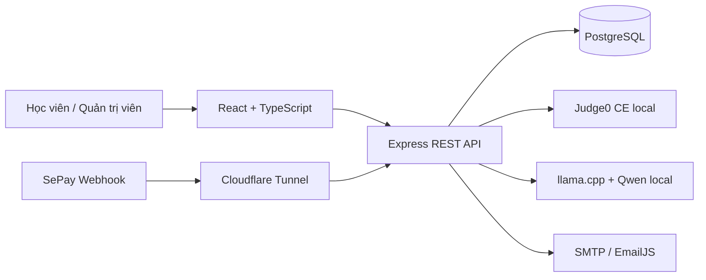
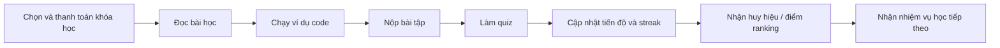
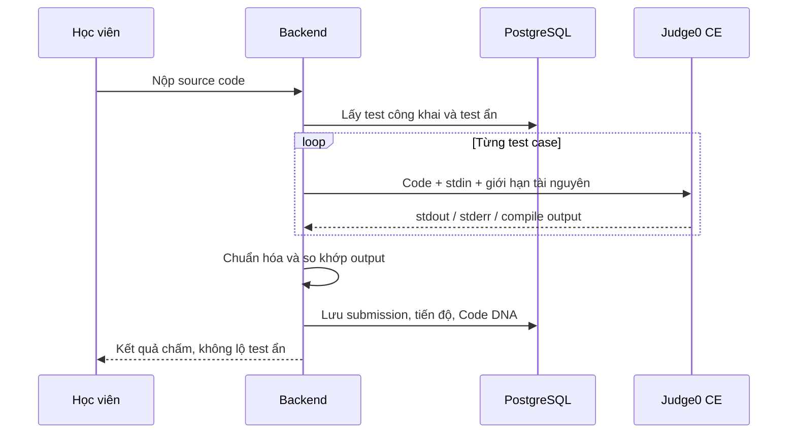
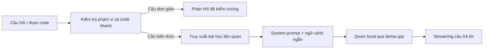
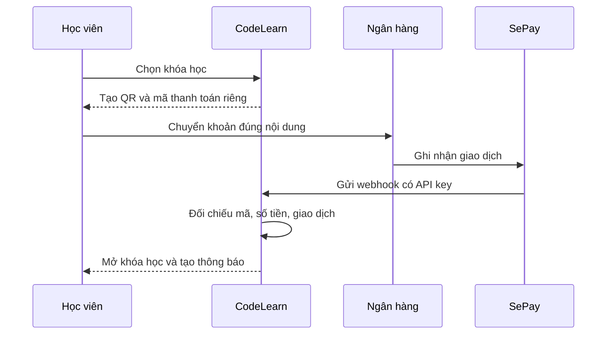
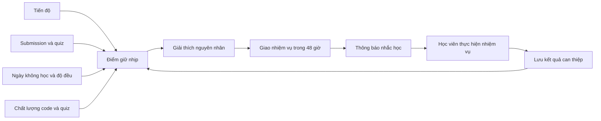
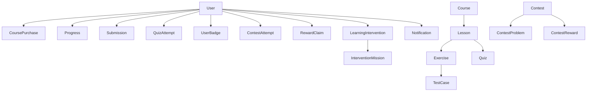

# NỘI DUNG SLIDE BẢO VỆ ĐỒ ÁN CHUYÊN NGÀNH

## CODELEARN - WEBSITE HỖ TRỢ HỌC LẬP TRÌNH

Tài liệu này chỉ gồm nội dung đặt trực tiếp lên slide, không có lời thuyết trình.

Thông tin nhóm em cần điền trước khi làm PowerPoint:

- Tên trường, khoa và bộ môn.
- Tên giảng viên hướng dẫn.
- Họ tên, mã số sinh viên và lớp của từng thành viên.
- Logo trường và thời gian bảo vệ.

---

## Slide 1. Trang bìa

### CODELEARN

**Website hỗ trợ học lập trình và duy trì nhịp học tập**

Đồ án chuyên ngành Công nghệ thông tin

- Giảng viên hướng dẫn: **[Điền tên giảng viên]**
- Nhóm sinh viên thực hiện: **[Điền tên thành viên]**
- Lớp: **[Điền lớp]**
- Năm học: **2025 - 2026**

**Hình nên dùng:** Logo CodeLearn và ảnh giao diện trang chủ.

---

## Slide 2. Lý do chọn đề tài

### Vì sao nhóm em xây dựng CodeLearn?

- Học lập trình không chỉ cần đọc lý thuyết mà phải thường xuyên viết, chạy và sửa code.
- Công cụ chấm code riêng lẻ cho biết đúng hoặc sai nhưng thường thiếu lộ trình học và theo dõi tiến độ.
- Nhiều website hỗ trợ tốt khi học viên đang học, nhưng chưa quan tâm đúng mức đến thời điểm học viên bắt đầu mất nhịp.
- Với học viên đã trả phí, việc bỏ dở khóa học ảnh hưởng trực tiếp đến hiệu quả học tập và độ tin cậy của nền tảng.
- Nhóm em muốn xây dựng một hệ thống kết hợp được cả **học tập, thực hành, tạo động lực và can thiệp sớm**.

**Thông điệp chính:**  
CodeLearn không chỉ giúp học viên học code mà còn tạo lý do để học viên tiếp tục quay lại học.

---

## Slide 3. Bài toán đặt ra

### Những vấn đề hệ thống cần giải quyết

1. Cung cấp lộ trình học có cấu trúc cho SQL, C, C++ và Python.
2. Cho phép chạy code và chấm bài mà học viên không cần cài compiler.
3. Bảo vệ test case ẩn và kiểm soát code không tin cậy.
4. Hỗ trợ AI theo đúng nội dung khóa học, không trả lời lan man.
5. Ghi nhận tiến độ, quiz, submission, streak và thành tích của học viên.
6. Phát hiện học viên trả phí có dấu hiệu bỏ học để can thiệp sớm.
7. Tạo động lực bằng thi đua, ranking và phần thưởng.
8. Tự chủ các chức năng lõi, hạn chế phụ thuộc quota của dịch vụ bên ngoài.

---

## Slide 4. Mục tiêu và phạm vi

### Mục tiêu của đề tài

- Xây dựng website học lập trình theo chu trình:

  **Học lý thuyết → Thực hành → Nhận phản hồi → Theo dõi tiến độ → Tiếp tục học**

- Hỗ trợ bốn ngôn ngữ: **SQL, C, C++ và Python**.
- Có hai nhóm người dùng chính:
  - **Học viên:** mua khóa học, học bài, chạy code, làm bài tập, quiz và tham gia thi đua.
  - **Quản trị viên:** quản lý học liệu, thanh toán, mùa thi, phần thưởng và học viên có nguy cơ bỏ học.
- Xây dựng hệ thống theo hướng local-first cho AI Tutor và trình chấm code.
- Hình thành một vòng kín giữ chân học viên dựa trên dữ liệu học thật.

---

## Slide 5. Tổng quan giải pháp

### Các phân hệ chính của CodeLearn

| Nhóm chức năng | Nội dung |
|---|---|
| Học tập | Khóa học, bài học Markdown, ví dụ code, bài tập, quiz |
| Thực hành | CodeMirror, Pyodide, sql.js, Judge0 CE |
| Cá nhân hóa | Tiến độ, streak, huy hiệu, Code DNA |
| Tạo động lực | Mùa thi, phòng thi, ranking, phần thưởng |
| Giữ chân | Điểm giữ nhịp, nhiệm vụ hôm nay, gói cứu nhịp 48 giờ |
| Hỗ trợ | AI Tutor local, trung tâm thông báo, email tùy chọn |
| Quản trị | Học liệu, người dùng, thanh toán, thi đua, can thiệp sớm |

### Quy mô phiên bản hiện tại

- 4 khóa học.
- 15 bài học.
- 12 bài tập.
- 34 test case.
- 15 quiz.
- Khoảng 30 mô hình dữ liệu và hơn 80 API endpoint.

---

## Slide 6. Kiến trúc tổng thể

### Kiến trúc nhiều lớp

### Nguyên tắc thiết kế

- Frontend không truy cập trực tiếp database, Judge0 hoặc Llama.
- Backend là nơi kiểm tra quyền, xử lý nghiệp vụ và bảo vệ dữ liệu.
- PostgreSQL là nguồn dữ liệu chính của hệ thống.
- Judge0 và llama.cpp chạy thành các dịch vụ local độc lập bằng Docker.
- Các tích hợp ngoài như SePay hoặc email không được phép làm hỏng dữ liệu cốt lõi.

---

## Slide 7. Công nghệ sử dụng

| Thành phần | Công nghệ |
|---|---|
| Frontend | React, Vite, TypeScript, TailwindCSS |
| Trình soạn thảo | CodeMirror 6 |
| Backend | Node.js, Express, TypeScript |
| ORM và database | Prisma, PostgreSQL |
| Chạy Python trên trình duyệt | Pyodide |
| Chạy SQL trên trình duyệt | sql.js |
| Chạy và chấm code phía server | Judge0 CE |
| AI Tutor | Qwen2.5 1.5B GGUF, llama.cpp |
| RAG | PostgreSQL full-text search, embedding offline |
| Kiểm thử | Vitest, Supertest, Playwright |
| Triển khai local | Docker Compose, Cloudflare Quick Tunnel |

### Lý do lựa chọn

- Cùng sử dụng TypeScript ở frontend và backend để giảm sai khác kiểu dữ liệu.
- Các công nghệ chính đều có thể chạy local và phù hợp phạm vi đồ án.
- Kiến trúc cho phép thay runner hoặc model mà không phải viết lại toàn bộ giao diện.

---

## Slide 8. Luồng học tập của học viên

### Một chu trình học hoàn chỉnh

- Bài học kết hợp nội dung, ví dụ code và bài thực hành.
- Kết quả học được lưu thành progress, submission và quiz attempt.
- Dữ liệu này tiếp tục được dùng cho ranking, Code DNA và Trạm giữ nhịp.
- Học viên không chỉ biết mình đã học bao nhiêu mà còn biết nên làm gì tiếp theo.

---

## Slide 9. Chạy code và chấm bài tự động

### Phân chia runner theo mục đích

- **Python playground:** chạy nhanh bằng Pyodide trong trình duyệt.
- **SQL playground:** chạy bằng sql.js trong trình duyệt.
- **C, C++ và bài nộp server-side:** xử lý qua Judge0 CE local.
- Kết quả phía client chỉ dùng để thử code, không dùng để chấm test case ẩn.

### Luồng chấm bài

### Giá trị đạt được

- Không còn phụ thuộc Wandbox.
- Có giới hạn CPU, RAM, thời gian chạy và tắt network.
- Test case ẩn chỉ tồn tại và được chấm ở phía server.

---

## Slide 10. AI Tutor chạy local

### Luồng xử lý AI

### Các điểm chính

- Không dùng Groq API và không phụ thuộc quota.
- Model Qwen2.5 1.5B Q4_K_M chạy local qua API tương thích OpenAI.
- RAG giúp câu trả lời bám theo học liệu riêng của CodeLearn.
- Guardrail chỉ cho phép nội dung về SQL, C, C++, Python và khóa học.
- Các lỗi code cơ bản được kiểm tra trước khi gọi model để phản hồi nhanh và hạn chế AI tự sửa sai đầu vào.
- Câu trả lời được stream dần để giảm cảm giác chờ.

### Giới hạn được thừa nhận

Model 1.5B phù hợp demo local nhưng khả năng suy luận vẫn thấp hơn các model lớn.

---

## Slide 11. Thanh toán và mở khóa học

### Luồng thanh toán VietQR và SePay

### Kiểm soát chính

- Mỗi giao dịch có mã thanh toán riêng.
- Webhook được xác thực bằng API key.
- Xử lý idempotent để webhook gửi lại không mở khóa hai lần.
- Khi chạy local, Cloudflare Quick Tunnel chuyển webhook HTTPS về backend.
- Chế độ thanh toán demo tự tắt trong môi trường production.

---

## Slide 12. Thi đua, ranking và phần thưởng

### CodeLearn Sprint

- Admin tạo mùa thi, thời gian bắt đầu, kết thúc và phạm vi khóa học.
- Phòng thi có thời gian giới hạn, gồm bài code hoặc quiz.
- Học viên bắt đầu attempt, làm bài và nộp để chốt điểm.
- Ranking không lấy dữ liệu giả mà tính từ hoạt động học thật:
  - Hoàn thành bài học, bài tập và quiz.
  - Submission pass.
  - Điểm quiz và điểm phòng thi.
  - Streak và huy hiệu.

### Cơ chế phần thưởng

| Xếp hạng | Phần thưởng |
|---|---|
| Top 1 | Hoàn 50% học phí |
| Top 2 - 3 | Voucher 30% khóa tiếp theo |
| Top 4 - 10 | Huy hiệu đặc biệt và nội dung nâng cao |

- Học viên gửi yêu cầu nhận thưởng.
- Admin duyệt hoặc từ chối reward claim.

**Mục tiêu:** biến kết quả học đều thành động lực ngắn hạn có giá trị rõ ràng.

---

## Slide 13. Điểm khác biệt: vòng kín giữ chân học viên

### Từ dữ liệu học đến hành động can thiệp

### Điểm nhóm em muốn nhấn mạnh

- Hệ thống không dừng ở việc cảnh báo học viên có nguy cơ.
- Mỗi cảnh báo được chuyển thành nhiệm vụ cụ thể và có thời hạn.
- Trạng thái nhiệm vụ được xác nhận từ dữ liệu học thật, không do học viên tự đánh dấu.
- Kết quả trước và sau can thiệp được lưu lại để tiếp tục đánh giá.

---

## Slide 14. Công thức điểm giữ nhịp

### RETENTION_V3_2026_07 - Tổng 100 điểm

| Thành phần | Điểm tối đa |
|---|---:|
| Hoạt động gần nhất | 25 |
| Độ đều trong 14 ngày | 20 |
| Tiến độ tổng và nội dung mới | 20 |
| Chất lượng code và quiz | 25 |
| Xu hướng tuần này so với tuần trước | 10 |

### Phân nhóm

- **Dưới 45 điểm:** Nguy cơ bỏ nhịp cao.
- **Từ 45 đến dưới 70 điểm:** Cần theo dõi.
- **Từ 70 điểm trở lên:** Đang giữ nhịp ổn định.

### Nguyên tắc

- Chỉ đánh giá nguy cơ đối với học viên đã thanh toán khóa học.
- Người chưa mua khóa được hiển thị trạng thái **“Chưa bắt đầu khóa học”**.
- API trả cả điểm thành phần và lý do, không đưa ra một con số hộp đen.
- Biểu đồ 28 ngày cho thấy điểm tăng, giảm, trung bình, điểm tốt nhất và chênh lệch 7 ngày.
- Nghỉ học từ 14 ngày luôn là nguy cơ cao; nghỉ từ 7 ngày không thể được xếp ổn định.
- Đây là công thức heuristic giải thích được, chưa phải mô hình dự đoán đã được kiểm định.

---

## Slide 15. Trạm giữ nhịp và Can thiệp sớm

### Phía học viên - `/retention`

- Xem điểm giữ nhịp và mức rủi ro hiện tại.
- Biết rõ những yếu tố nào đang làm điểm tăng hoặc giảm.
- Nhận tối đa ba nhiệm vụ ưu tiên:
  - Học bài tiếp theo.
  - Làm bài tập hoặc quiz.
  - Tham gia mùa thi.
- Theo dõi gói cứu nhịp 48 giờ và số nhiệm vụ đã hoàn thành.

### Phía quản trị viên - `/admin/retention`

- Xem danh sách học viên trả phí theo từng mức rủi ro.
- Theo dõi số ngày không học, streak, tiến độ và khóa yếu nhất.
- Giao trực tiếp gói cứu nhịp 48 giờ.
- Soạn email nhắc học nhanh.
- Theo dõi can thiệp đang hoạt động, đã hoàn thành hoặc hết hạn.
- Lưu điểm nền, tỷ lệ hoàn thành và mức thay đổi sau can thiệp.

---

## Slide 16. Trung tâm thông báo và Code DNA

### Trung tâm thông báo

- Thông báo thanh toán thành công và mở khóa học.
- Thông báo yêu cầu, duyệt hoặc từ chối phần thưởng.
- Nhắc mùa thi sắp bắt đầu hoặc kết thúc.
- Nhắc nguy cơ mất nhịp và gói can thiệp mới.
- Thông báo huy hiệu vừa nhận.
- Có trạng thái đã đọc và `dedupeKey` để chống tạo trùng.
- Email là kênh bổ sung; thông báo trong ứng dụng vẫn hoạt động khi chưa cấu hình email.

### Hồ sơ lỗi Code DNA

- Mỗi submission sai được phân loại theo luật minh bạch.
- Các nhóm lỗi chính:
  - Cú pháp.
  - Biến hoặc hàm chưa khai báo.
  - Kiểu dữ liệu.
  - Thư viện hoặc header.
  - Con trỏ và bộ nhớ.
  - Định dạng output.
  - Thuật toán chưa bao phủ hết.
- Hệ thống tổng hợp lỗi lặp lại, ngôn ngữ yếu và đưa ra ưu tiên luyện tập.

**Giá trị:** một bài nộp sai không bị bỏ đi mà tiếp tục trở thành dữ liệu hỗ trợ học tập.

---

## Slide 17. Bảo mật và độ tin cậy

### Các biện pháp đã thực hiện

- Mật khẩu được băm bằng Argon2id.
- JWT lưu trong cookie HttpOnly và SameSite.
- Middleware xác thực và phân quyền ADMIN cho API quản trị.
- Dữ liệu đầu vào được kiểm tra bằng Zod.
- Helmet bổ sung các HTTP security header.
- Markdown được làm sạch bằng DOMPurify trước khi hiển thị.
- Prisma sử dụng truy vấn tham số hóa để giảm nguy cơ SQL Injection.
- Rate limit cho đăng nhập, chạy code, nộp bài và AI.
- Test case ẩn không được trả về frontend.
- Judge0 giới hạn CPU, RAM, thời gian và network của code người học.
- Webhook thanh toán có API key và xử lý idempotent.
- Secret được đặt trong biến môi trường, không commit file `.env`.

---

## Slide 18. Kiểm thử và kết quả xác nhận

### Kết quả gần nhất

| Hạng mục | Kết quả |
|---|---:|
| Server unit và integration | 66/66 đạt |
| Client unit | 4/4 đạt |
| E2E desktop và mobile | 6/6 đạt |
| Server build | Đạt |
| Client build | Đạt |
| ESLint client và server | Đạt |
| Smoke test dịch vụ và API | Đạt |

### Phạm vi đã kiểm tra

- Xác thực, phân quyền và bảo mật mật khẩu.
- Chấm bài, lỗi biên dịch/runtime và bảo vệ test ẩn.
- Thanh toán SePay và webhook idempotent.
- RAG, guardrail và phân biệt code Python đúng/sai.
- Tiến độ, streak, ranking, retention và Code DNA.
- Các luồng trọng yếu trên Edge desktop và mobile.
- Trạng thái frontend, backend, Judge0, Llama và các API nghiệp vụ.

**Lưu ý:** số lượng test không được xem là code coverage; dự án chưa đo coverage tổng thể.

---

## Slide 19. Điểm khác biệt và đánh giá khắt khe

### CodeLearn khác ở cách các chức năng được liên kết

| Website học code thông thường | CodeLearn |
|---|---|
| Hiển thị phần trăm tiến độ | Giải thích nguy cơ bỏ nhịp từ nhiều tín hiệu |
| Chấm bài đúng hoặc sai | Dùng submission để tạo hồ sơ lỗi Code DNA |
| Bảng xếp hạng theo một bài thi | Ranking từ cả quá trình học thật |
| Gửi thông báo chung | Giao nhiệm vụ 48 giờ theo từng học viên |
| Chatbot đứng riêng | AI Tutor có RAG từ học liệu của hệ thống |
| Cảnh báo rủi ro | Lưu can thiệp và đo kết quả sau can thiệp |

### Nhóm em không khẳng định từng tính năng là hoàn toàn mới

Điểm khác biệt có thể bảo vệ bằng code và dữ liệu là **vòng kín từ phát hiện → giải thích → can thiệp → nhắc học → đo kết quả**.

---

## Slide 20. Hạn chế và hướng phát triển

### Hạn chế hiện tại

- Điểm giữ nhịp là heuristic, chưa được hiệu chỉnh bằng dữ liệu học viên thật trong nhiều tuần.
- Chưa có nhóm đối chứng để chứng minh gói cứu nhịp làm tăng tỷ lệ quay lại.
- Qwen 1.5B có giới hạn về suy luận và chất lượng tiếng Việt chuyên sâu.
- Judge0 local chưa có hàng đợi ứng dụng, quota theo người dùng và hệ thống giám sát riêng.
- Quick Tunnel thay đổi URL mỗi lần chạy lại.
- Email chưa có queue retry và dashboard theo dõi trạng thái gửi.
- Reward claim chưa tự động phát hành voucher hoặc hoàn tiền.
- Frontend vẫn còn một số bundle lớn cần tối ưu.

### Hướng phát triển ưu tiên

1. Thu thập dữ liệu thật trong 4-8 tuần.
2. Đo tỷ lệ quay lại trong 24/48 giờ và hiệu quả của can thiệp.
3. Xây dựng bộ đánh giá RAG và Code DNA có nhãn từ giảng viên.
4. Thêm queue cho email, audit log và job định kỳ.
5. Mở rộng chấm SQL server-side và tối ưu Judge0.
6. Hiệu chỉnh điểm rủi ro bằng mô hình thống kê khi đủ dữ liệu.

---

## Slide 21. Kết luận

### Kết quả nhóm em đạt được

- Xây dựng đầy đủ nền tảng học SQL, C, C++ và Python.
- Tự chủ hai chức năng lõi bằng Judge0 CE và Llama local.
- Hoàn thiện các luồng học, chạy code, chấm bài, quiz, thanh toán và quản trị.
- Xây dựng thi đua, ranking, phòng thi và quy trình nhận thưởng.
- Biến dữ liệu học thành Trạm giữ nhịp, Code DNA và dashboard Can thiệp sớm.
- Có kiểm thử tự động, dữ liệu demo và script khởi động toàn bộ môi trường.

### Câu chốt

**CodeLearn không chỉ cung cấp bài học và trình chạy code. Hệ thống sử dụng dữ liệu học thật để giao nhiệm vụ hôm nay, tạo động lực bằng ranking và phần thưởng, hỗ trợ bằng AI Tutor local, đồng thời giúp quản trị viên phát hiện và can thiệp sớm khi học viên trả phí có nguy cơ bỏ học.**

---

# CÁC SLIDE DỰ PHÒNG

Các slide dưới đây chỉ dùng khi cần trình bày sâu hơn hoặc trả lời câu hỏi của giảng viên.

---

## Slide dự phòng 1. Mô hình dữ liệu theo miền

### Các miền dữ liệu chính

- Tài khoản và phân quyền.
- Nội dung học tập.
- Chấm bài và tiến độ.
- Thanh toán.
- Thi đua và phần thưởng.
- Giữ nhịp và can thiệp.
- Thông báo và hồ sơ lỗi.

---

## Slide dự phòng 2. So sánh trước và sau khi nâng cấp

| Thành phần | Phiên bản đầu | Phiên bản hiện tại |
|---|---|---|
| AI Tutor | Groq API | Qwen local qua llama.cpp |
| Chạy/chấm C, C++ | Wandbox API | Judge0 CE local |
| Theo dõi học tập | Tiến độ cơ bản | Điểm giữ nhịp và gói 48 giờ |
| Bảng xếp hạng | Xếp hạng chung | Ranking theo mùa từ dữ liệu học thật |
| Phần thưởng | Chưa có quy trình | Reward claim và admin duyệt |
| Hỗ trợ học viên yếu | Chưa có | Dashboard Can thiệp sớm |
| Phân tích bài sai | Chỉ đúng/sai | Code DNA và AI giải thích lỗi |
| Thông báo | Rời rạc | Trung tâm thông báo và email tùy chọn |

---

## Slide dự phòng 3. Các API chính

| API | Mục đích |
|---|---|
| `POST /api/exercises/:id/submit` | Chấm bài và lưu submission |
| `POST /api/ai/chat/stream` | Chat AI có streaming |
| `POST /api/ai/explain-exercise-error/stream` | Giải thích lỗi bài tập |
| `POST /api/payments/sepay/webhook` | Xác nhận giao dịch SePay |
| `GET /api/contests` | Danh sách mùa thi |
| `POST /api/contests/:id/attempts` | Bắt đầu phòng thi |
| `GET /api/retention/plan` | Điểm và nhiệm vụ giữ nhịp |
| `GET /api/learning/error-profile` | Hồ sơ lỗi Code DNA |
| `GET /api/notifications` | Trung tâm thông báo |
| `GET /api/admin/retention-risks` | Danh sách học viên có nguy cơ |

---

## Slide dự phòng 4. Kịch bản demo đề xuất

1. Chạy `npm run demo:up`.
2. Kiểm tra bằng `npm run demo:smoke`.
3. Mở website tại `http://localhost:5173`.
4. Demo AI Tutor local và guardrail.
5. Demo chạy code và chấm bài qua Judge0.
6. Demo thanh toán hoặc trạng thái mở khóa học.
7. Demo mùa thi, ranking, phòng thi và phần thưởng.
8. Demo Trạm giữ nhịp của học viên.
9. Demo Code DNA và trung tâm thông báo.
10. Demo dashboard Can thiệp sớm của admin.

### Tài khoản demo

| Vai trò | Tài khoản | Mật khẩu |
|---|---|---|
| Admin | `admin@lpp.local` | `admin12345` |
| Nguy cơ cao | `roi.nhip@lpp.local` | `hocvien123` |
| Cần theo dõi | `can.theo.doi@lpp.local` | `hocvien123` |
| Ổn định | `giu.nhip@lpp.local` | `hocvien123` |

---

## Slide dự phòng 5. Các chỉ số cần thu thập khi triển khai thật

- Tỷ lệ học viên quay lại sau 1 ngày và 7 ngày.
- Tỷ lệ học viên quay lại trong 24/48 giờ sau khi nhận thông báo.
- Tỷ lệ can thiệp hoàn thành, hết hạn và bị bỏ dở.
- Điểm giữ nhịp trước và sau can thiệp.
- Mức tăng tiến độ sau khi hoàn thành gói cứu nhịp.
- Tỷ lệ pass theo ngôn ngữ và nhóm lỗi.
- Tỷ lệ tham gia mùa thi và yêu cầu nhận thưởng.
- Tỷ lệ hoàn thành khóa của nhóm được can thiệp và nhóm đối chứng.

**Nguyên tắc:** khi chưa có dữ liệu đủ dài, nhóm em chỉ trình bày đây là các chỉ số hệ thống đã sẵn sàng thu thập, không xem là kết quả đã được chứng minh.
