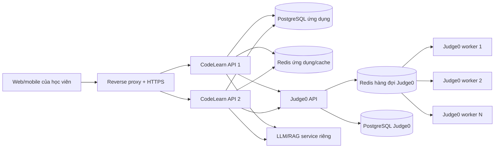

# Kế hoạch triển khai CodeLearn cho 1.000 học viên

## 1. Phạm vi cam kết

Con số 1.000 học viên cần được hiểu là 1.000 tài khoản có thể sử dụng hệ thống, không phải 1.000 lượt biên dịch đồng thời. Năng lực đồng thời chỉ được công bố sau khi đo tải trên đúng server triển khai.

Mục tiêu thử nghiệm ban đầu:

- 1.000 tài khoản, 50-100 người hoạt động đồng thời.
- 10-20 lượt gửi code mỗi giây ở thời điểm cao nhất.
- API thông thường có p95 dưới 500 ms.
- Bài code ngắn có p95 dưới 5 giây khi hàng đợi bình thường.
- Tỷ lệ lỗi hạ tầng dưới 1% trong bài đo tải.

Đây là tiêu chí nghiệm thu, không phải kết quả đã được chứng minh trên máy chủ hiện tại.

## 2. Kiến trúc đề xuất



Production không nên đặt database ứng dụng, Judge0, LLM và API trên một máy nhỏ. Nếu chỉ có một server, phải dành tài nguyên ưu tiên cho PostgreSQL và Judge0; LLM nên có máy hoặc GPU riêng.

## 3. Cấu hình khởi điểm

Với 1.000 tài khoản và 50-100 người dùng đồng thời, cấu hình để bắt đầu đo tải:

| Thành phần | Cấu hình khởi điểm |
|---|---|
| CodeLearn API | 2 instance, mỗi instance 2 vCPU và 2-4 GB RAM |
| PostgreSQL ứng dụng | 2-4 vCPU, 4-8 GB RAM, SSD, backup hằng ngày |
| Redis ứng dụng | 1 vCPU, 1 GB RAM |
| Judge0 API | 1-2 instance, mỗi instance 1 vCPU và 1 GB RAM |
| Judge0 worker | 2-4 container, mỗi container 2 vCPU và 1,5-2 GB RAM |
| PostgreSQL Judge0 | 2 vCPU, 2-4 GB RAM, SSD |
| Redis Judge0 | 1 vCPU, 1 GB RAM, AOF bật |
| Llama/RAG | Tách riêng; ưu tiên GPU, hoặc CPU 8 core và tối thiểu 16 GB RAM |

Thông số phải điều chỉnh theo độ nặng của test case. Bài C++ biên dịch lớn tiêu tốn CPU/RAM hơn bài Python ngắn.

## 4. Cơ chế bảo vệ đã có

- Backend gửi tác vụ bất đồng bộ vào Judge0 và poll token thay vì giữ kết nối `wait=true`.
- Có giới hạn đồng thời và hàng đợi trên từng backend instance qua `JUDGE0_MAX_CONCURRENT`, `JUDGE0_MAX_QUEUE` và `JUDGE0_QUEUE_TIMEOUT_MS`.
- Judge0 giới hạn CPU, wall time, RAM và tắt network của code người học.
- Docker Compose pin phiên bản Judge0, có health check cho API/database/Redis, restart policy, thời gian dừng an toàn và log rotation.
- Worker có thể tăng bằng `JUDGE0_WORKERS`; script local tự chạy `--scale judge0-worker=N`.
- Bảng xếp hạng mùa có cache ngắn để nhiều lượt mở trang không lặp truy vấn nặng.
- Rate limit dùng tài khoản đã đăng nhập làm khóa, tránh việc cả phòng máy chung NAT bị dùng chung một quota.

## 5. Mở rộng ngôn ngữ

Course, exercise và API không còn bị khóa trong enum SQL/C/C++/Python. Backend đọc `/languages` của Judge0, cache danh sách runtime và chọn theo tên.

Quy trình thêm khóa học Java, JavaScript, Go hoặc Rust:

1. Kiểm tra runtime xuất hiện tại `GET http://judge0-host:2358/languages`.
2. Tạo course/exercise với mã ngôn ngữ viết hoa, ví dụ `JAVA`, `JAVASCRIPT`, `GO`.
3. Nếu tên runtime đặc biệt, cấu hình `JUDGE0_LANGUAGE_MAP={"JAVA":62}`.
4. Chạy bộ test mẫu gồm compile thành công, lỗi compile, stdin/stdout và timeout.
5. Bổ sung syntax highlighting tương ứng trên frontend nếu muốn trải nghiệm editor đầy đủ.

SQL playground vẫn dùng `sql.js` ở trình duyệt. Judge0 SQL runtime có thể dùng cho bài chấm server-side sau khi xây bộ dữ liệu đầu vào và cách so sánh kết quả.

## 6. Đo tải

Khởi động Judge0 rồi chạy:

```powershell
$env:LOAD_TOTAL="50"
$env:LOAD_CONCURRENCY="10"
npm run load:judge0
```

Tăng tải theo từng bậc `10/2`, `50/10`, `100/20`, không nhảy thẳng lên tải lớn. Ghi lại:

- p50, p95 và max latency.
- Throughput submission/giây.
- CPU/RAM từng worker.
- Độ dài hàng đợi Redis.
- Số lỗi compile/runtime/hạ tầng.
- Dung lượng PostgreSQL và tốc độ tăng log.

Chỉ tăng số worker khi CPU/RAM còn đủ. Nếu worker đều bận nhưng Judge0 API nhẹ, tăng worker. Nếu database hoặc Redis nghẽn, tăng worker sẽ làm tình hình xấu hơn.

Kết quả đo trên máy demo ngày 28/07/2026 với hai container worker, mỗi container `COUNT=2`:

| Tổng lượt | Đồng thời | Kết quả | p95 | Throughput |
|---:|---:|---:|---:|---:|
| 20 | 4 | 20/20 | 2,38 giây | 2,80 lượt/giây |
| 50 | 10 | 50/50 | 3,91 giây | 3,71 lượt/giây |
| 100 | 20 | 100/100 | 6,24 giây | 3,78 lượt/giây |

Đây là số đo cho chương trình Python rất ngắn trên máy demo, không được dùng thay cho load test trên server thật. C, C++, Python và SQL cũng đã được kiểm tra riêng và đều trả trạng thái `Accepted`.

## 7. Điều kiện trước khi public

- Dùng domain cố định và HTTPS; không dùng Quick Tunnel cho production.
- Thay toàn bộ JWT, Judge0, database, SePay và SMTP secret.
- Không public cổng PostgreSQL/Redis/Judge0 ra Internet; API ứng dụng gọi qua private network.
- Cấu hình backup và thử phục hồi database.
- Có dashboard CPU, RAM, disk, queue depth, p95 latency và tỷ lệ lỗi.
- Có cảnh báo khi disk trên 80%, queue tăng liên tục hoặc worker restart.
- Chạy migration trước khi đưa phiên bản mới nhận traffic.
- Thử rollback ứng dụng và phục hồi backup trước ngày nghiệm thu.

## 8. Giai đoạn tiếp theo

Khi số lượt chạy code đồng thời vượt khoảng 100, nên tách API nộp bài thành job bất đồng bộ: frontend nhận `jobId`, theo dõi trạng thái qua polling hoặc WebSocket và đọc kết quả sau. Khi chạy nhiều backend instance, cache bảng xếp hạng và bộ đếm giới hạn toàn cục nên chuyển sang Redis thay vì bộ nhớ từng process.
